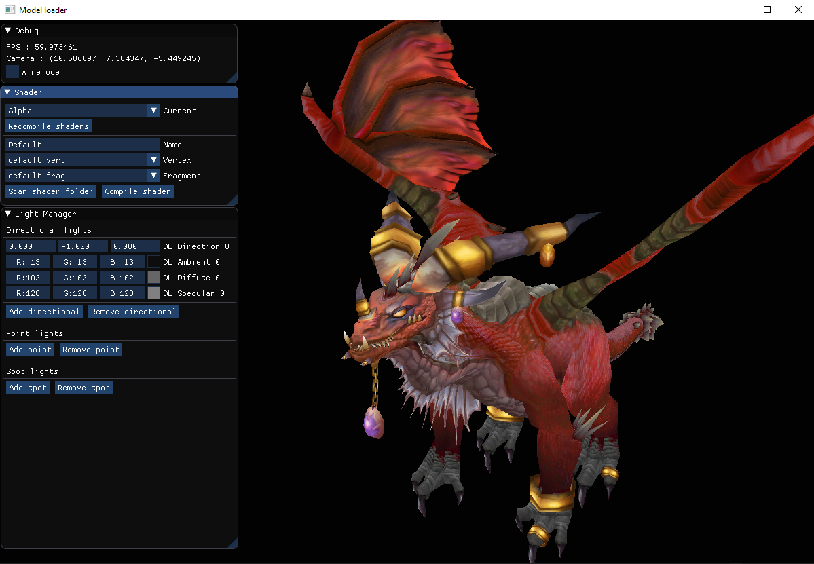

# model_loader

Based on [learnopengl.com](https://learnopengl.com) tutorial Model Loading.

The goal of this project is to provide a small environnement which allows me to play with the concepts I learned (lighting, shaders, etc) in the tutorial without recompiling the whole project each time I modify something.

## controls

* Move with Z, Q, S, D
* Unlock cursor with left Ctrl key
* Recompile shaders will recompile all shaders whose vertex and fragment files have been modified since last compilation
* Scan shader folder will search for new vertex/fragment shader and add them to the right combo box
* Shaders can be added in resources/shaders

## limitations

* Shaders names should be unique
* Limited to 20 lights by type
* Do not remove default.vert and default.frag from the resources/shaders folder
* Textures must be in the same folder as their model

## requirements

* C++ 17 compiler
* DirectX SDK (used by Assimp, can be downloaded [here](http://www.microsoft.com/en-us/download/details.aspx?id=6812))

## screenshots

I take the following screenshots with World of Warcraft models extracted with WoW Model Viewer. These models are not included in the repository (I'm not an expert in copyrights, but i'm pretty sure that i don't own any rights on them), but you can test the program with the nanosuit model provided.

###### .obj with default shader

###### .obj with lighting shader

###### .fbx with default alpha shader

## updates

* 04/01/2020 : handle embedded texture in .fbx file
* 03/01/2020 : add ShaderManager class
* 17/12/2019 : initial commit