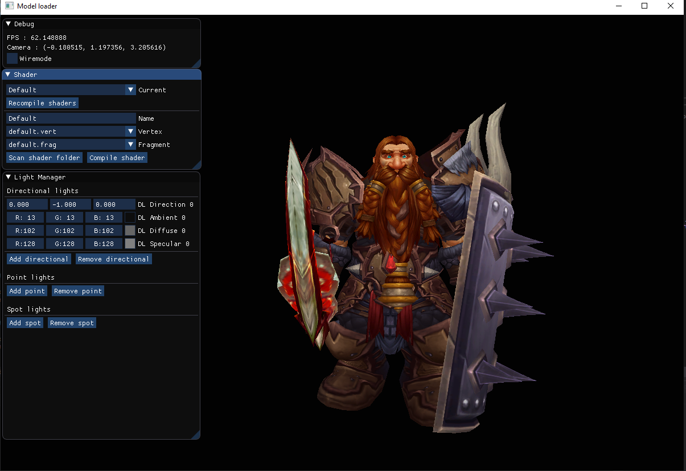

# model_loader

Based on [learnopengl.com](https://learnopengl.com) tutorial Model Loading.

I only used .obj so far, but Assimp should handle other 3D model formats. The goal of this project is to provide a small environnement which allows me to play with the concepts I learned (lighting, shaders, etc) in the tutorial without recompiling the whole project each time I modify something.

## controls

* Move with Z, Q, S, D
* Unlock cursor with left Ctrl key
* Recompile shaders will recompile all shaders whose vertex and fragment files have been modified since last compilation
* Scan shader folder will search for new vertex/fragment shader and add them to the right combo box
* Shaders can be added in resources/shaders

## limitations

* Shaders names should be unique
* Limited to 20 lights by type
* Do not remove default.vert and default.frag from the resources/shaders folder
* Textures must be in the same folder as their model

## requirements

* C++ 17 compiler
* DirectX SDK (used by Assimp, can be downloaded [here](http://www.microsoft.com/en-us/download/details.aspx?id=6812))

## screenshots

I take the following screenshots with a model of my World of Warcraft character extracted from WoW Model Viewer. This model is not included in the repository (I'm not an expert with copyrights, but i suppose i don't own any rights on it), but you can test the program with the nanosuit model provided.

## updates

* 03/01/2020 : add ShaderManager class
* 17/12/2019 : initial commit